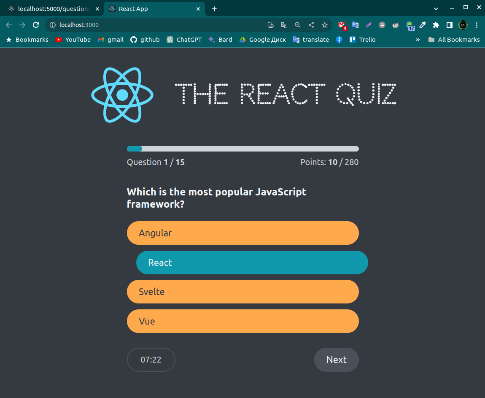
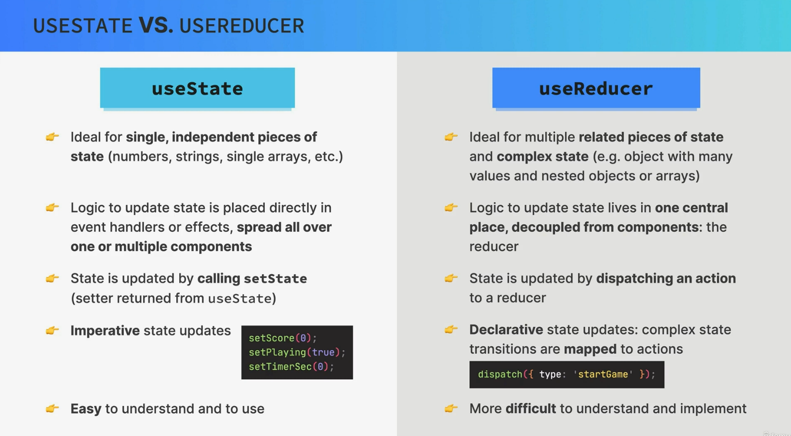
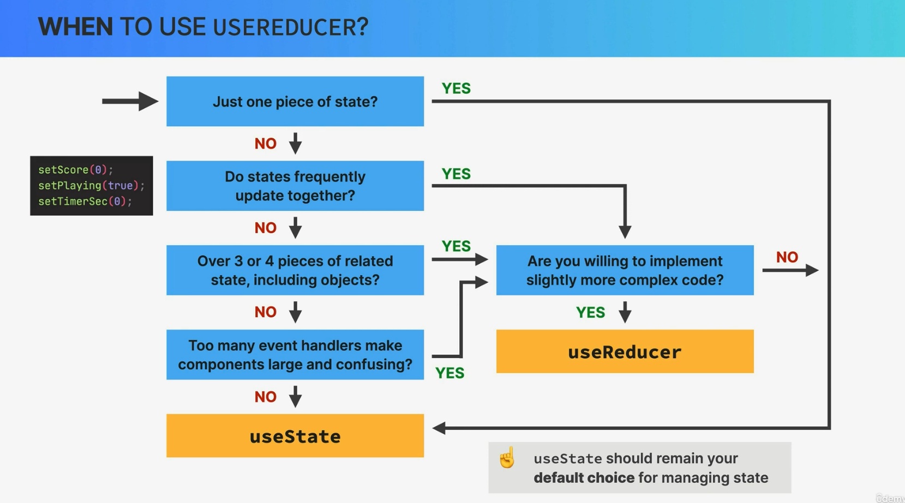

# useReducer




`useReducer` is a React hook that is used for managing state in functional components, especially when the state logic is complex or involves multiple sub-values, or when you need to perform actions based on dispatched actions. It is an alternative to `useState` and is often preferred when your state logic becomes more involved. `useReducer` takes a reducer function and an initial state as arguments and returns the current state and a dispatch function to update the state based on actions.

Here's how to use `useReducer`:

1. **Define a Reducer Function**:

   Start by defining a reducer function that specifies how the state should change in response to actions. The reducer function takes two arguments: the current state and an action object, and it returns the new state.

   ```jsx
   const reducer = (state, action) => {
     switch (action.type) {
       case "INCREMENT":
         return { count: state.count + 1 };
       case "DECREMENT":
         return { count: state.count - 1 };
       default:
         return state;
     }
   };
   ```

2. **Call `useReducer`**:

   In your functional component, call `useReducer` and pass in the reducer function and an initial state as arguments. It returns the current state and a dispatch function that you can use to send actions.

   ```jsx
   import React, { useReducer } from "react";

   function Counter() {
     const initialState = { count: 0 };
     const [state, dispatch] = useReducer(reducer, initialState);
     // ...
   }
   ```

3. **Dispatch Actions**:

   To update the state, you can call the `dispatch` function and provide an action object with a `type` property. The `type` property is used by the reducer function to determine how to update the state.

   ```jsx
   const increment = () => {
     dispatch({ type: "INCREMENT" });
   };

   const decrement = () => {
     dispatch({ type: "DECREMENT" });
   };
   ```

4. **Access and Use State**:

   You can access the current state by using `state.count` or the specific property you defined in your state object.

   ```jsx
   return (
     <div>
       <p>Count: {state.count}</p>
       <button onClick={increment}>Increment</button>
       <button onClick={decrement}>Decrement</button>
     </div>
   );
   ```

5. **Optional Actions Payload**:

   You can include additional data in the action object to provide more context for state updates. For example:

   ```jsx
   dispatch({ type: "INCREMENT", payload: 5 });
   ```

6. **Advanced Usage**:

   `useReducer` is particularly useful when managing complex state or state transitions, such as forms, multi-step wizards, or data fetching with more intricate loading/error handling.

Here's a complete example of a counter component using `useReducer`:

```jsx
import React, { useReducer } from "react";

const reducer = (state, action) => {
  switch (action.type) {
    case "INCREMENT":
      return { count: state.count + 1 };
    case "DECREMENT":
      return { count: state.count - 1 };
    default:
      return state;
  }
};

function Counter() {
  const initialState = { count: 0 };
  const [state, dispatch] = useReducer(reducer, initialState);

  const increment = () => {
    dispatch({ type: "INCREMENT" });
  };

  const decrement = () => {
    dispatch({ type: "DECREMENT" });
  };

  return (
    <div>
      <p>Count: {state.count}</p>
      <button onClick={increment}>Increment</button>
      <button onClick={decrement}>Decrement</button>
    </div>
  );
}

export default Counter;
```

In this example, `useReducer` is used to manage the count state, and the reducer function handles state updates based on actions. Actions are dispatched when the "Increment" and "Decrement" buttons are clicked.

## useState vs useReducer

`useState` and `useReducer` are two distinct state management hooks in React, and their choice depends on your specific use case and preferences. Here's a comparison of both hooks with examples to illustrate their differences and when to use each:

**useState**:

1. **Simple State Management**:

   `useState` is ideal for managing simple state where you have a single piece of data or a few related pieces of data that can be updated independently.

   ```jsx
   import React, { useState } from "react";

   function Counter() {
     const [count, setCount] = useState(0);

     const increment = () => {
       setCount(count + 1);
     };

     const decrement = () => {
       setCount(count - 1);
     };

     return (
       <div>
         <p>Count: {count}</p>
         <button onClick={increment}>Increment</button>
         <button onClick={decrement}>Decrement</button>
       </div>
     );
   }
   ```

2. **Simplicity and Readability**:

   `useState` is straightforward and often results in simpler and more readable code, especially for components with basic state management needs.

3. **Local Component State**:

   It is typically used for managing local state within a single component.

4. **Performance Optimization**:

   For small-scale applications or components where performance is not a critical concern, `useState` is sufficient.

**useReducer**:

1. **Complex State Management**:

   `useReducer` is suitable for managing complex state or state with multiple sub-values. It allows you to define custom state transitions based on dispatched actions.

   ```jsx
   import React, { useReducer } from "react";

   const initialState = { count: 0 };

   const reducer = (state, action) => {
     switch (action.type) {
       case "INCREMENT":
         return { count: state.count + 1 };
       case "DECREMENT":
         return { count: state.count - 1 };
       default:
         return state;
     }
   };

   function Counter() {
     const [state, dispatch] = useReducer(reducer, initialState);

     return (
       <div>
         <p>Count: {state.count}</p>
         <button onClick={() => dispatch({ type: "INCREMENT" })}>
           Increment
         </button>
         <button onClick={() => dispatch({ type: "DECREMENT" })}>
           Decrement
         </button>
       </div>
     );
   }
   ```

2. **Predictable State Updates**:

   It enforces a predictable pattern for state updates by dispatching actions with specific types, making it easier to understand how and why state changes occur.

3. **Shared or Global State**:

   `useReducer` is well-suited for managing shared or global state that needs to be accessed by multiple components.

4. **Middleware or Side Effects**:

   When your state logic involves middleware or side effects, `useReducer` can encapsulate these behaviors alongside the state.

5. **Testing**:

   It makes it easier to unit-test state management logic because you can test the reducer function independently of the component.

6. **Performance Optimization**:

   For large-scale applications with complex state interactions, `useReducer` can be more performant and maintainable than `useState`.

In summary, `useState` is appropriate for simpler state management needs and when you don't need to define custom state transitions. On the other hand, `useReducer` is well-suited for managing complex state, shared or global state, and state that involves custom logic or middleware. The choice between the two hooks depends on the specific requirements of your component and application.

## when to use useReducer





You should consider using `useReducer` in your React application when you encounter one or more of the following scenarios:

1. **Complex State Logic**:

   Use `useReducer` when your component's state logic becomes complex and involves multiple sub-values or when you need to perform actions based on dispatched actions. It helps simplify and centralize state management in such cases.

2. **Shared State Logic**:

   If you have multiple components that need to share and update the same state or if you have global state that is used across different parts of your application, `useReducer` can be a better choice than local component state (`useState`) to manage that shared state.

3. **State Transitions Based on Actions**:

   When you need to perform specific state transitions based on dispatched actions, `useReducer` provides a clean and organized way to define those transitions in a reducer function. This is particularly useful for components with complex interactions and transitions.

4. **Predictable State Updates**:

   `useReducer` encourages you to follow a predictable pattern for updating state by dispatching actions with specific types. This predictability can make it easier to understand how and why state changes occur in your component.

5. **Avoiding Excessive Re-renders**:

   In some cases, using `useState` for multiple state variables in a component can lead to excessive re-renders. `useReducer` can help mitigate this issue by consolidating state updates into a single state object and reducer function.

6. **Refactoring and Reusability**:

   If you find yourself duplicating state management logic across multiple components, consider refactoring that logic into a custom hook that uses `useReducer`. This promotes code reuse and keeps your codebase more maintainable.

7. **Middleware or Side Effects**:

   When your state management involves middleware or side effects like data fetching, authentication, or animation control, `useReducer` can be used to encapsulate these behaviors alongside the state.

8. **Testing**:

   `useReducer` can make testing easier because you can test the reducer function in isolation from the component. This allows for more comprehensive unit testing of state management logic.

9. **Maintaining a History of State**:

   In certain scenarios, you may want to maintain a history of previous states or implement undo/redo functionality. `useReducer` can be useful for keeping track of state history.

10. **Migrating from Class Components**:

    If you're migrating from class components to functional components, you may find that `useReducer` is a more suitable replacement for managing complex state and logic that was previously handled in lifecycle methods.

While `useState` is appropriate for managing simple local component state, `useReducer` becomes more advantageous as your component's state management requirements become more intricate. However, it's important to note that the choice between `useState` and `useReducer` can often be a matter of preference and context, and there is no one-size-fits-all answer. In many cases, either hook can be used effectively, and the decision depends on the specific needs of your component and application.

# Getting Started with Create React App

This project was bootstrapped with [Create React App](https://github.com/facebook/create-react-app).

## Available Scripts

In the project directory, you can run:

### `npm start`

Runs the app in the development mode.\
Open [http://localhost:3000](http://localhost:3000) to view it in your browser.

The page will reload when you make changes.\
You may also see any lint errors in the console.

### `npm test`

Launches the test runner in the interactive watch mode.\
See the section about [running tests](https://facebook.github.io/create-react-app/docs/running-tests) for more information.

### `npm run build`

Builds the app for production to the `build` folder.\
It correctly bundles React in production mode and optimizes the build for the best performance.

The build is minified and the filenames include the hashes.\
Your app is ready to be deployed!

See the section about [deployment](https://facebook.github.io/create-react-app/docs/deployment) for more information.

### `npm run eject`

**Note: this is a one-way operation. Once you `eject`, you can't go back!**

If you aren't satisfied with the build tool and configuration choices, you can `eject` at any time. This command will remove the single build dependency from your project.

Instead, it will copy all the configuration files and the transitive dependencies (webpack, Babel, ESLint, etc) right into your project so you have full control over them. All of the commands except `eject` will still work, but they will point to the copied scripts so you can tweak them. At this point you're on your own.

You don't have to ever use `eject`. The curated feature set is suitable for small and middle deployments, and you shouldn't feel obligated to use this feature. However we understand that this tool wouldn't be useful if you couldn't customize it when you are ready for it.

## Learn More

You can learn more in the [Create React App documentation](https://facebook.github.io/create-react-app/docs/getting-started).

To learn React, check out the [React documentation](https://reactjs.org/).

### Code Splitting

This section has moved here: [https://facebook.github.io/create-react-app/docs/code-splitting](https://facebook.github.io/create-react-app/docs/code-splitting)

### Analyzing the Bundle Size

This section has moved here: [https://facebook.github.io/create-react-app/docs/analyzing-the-bundle-size](https://facebook.github.io/create-react-app/docs/analyzing-the-bundle-size)

### Making a Progressive Web App

This section has moved here: [https://facebook.github.io/create-react-app/docs/making-a-progressive-web-app](https://facebook.github.io/create-react-app/docs/making-a-progressive-web-app)

### Advanced Configuration

This section has moved here: [https://facebook.github.io/create-react-app/docs/advanced-configuration](https://facebook.github.io/create-react-app/docs/advanced-configuration)

### Deployment

This section has moved here: [https://facebook.github.io/create-react-app/docs/deployment](https://facebook.github.io/create-react-app/docs/deployment)

### `npm run build` fails to minify

This section has moved here: [https://facebook.github.io/create-react-app/docs/troubleshooting#npm-run-build-fails-to-minify](https://facebook.github.io/create-react-app/docs/troubleshooting#npm-run-build-fails-to-minify)
