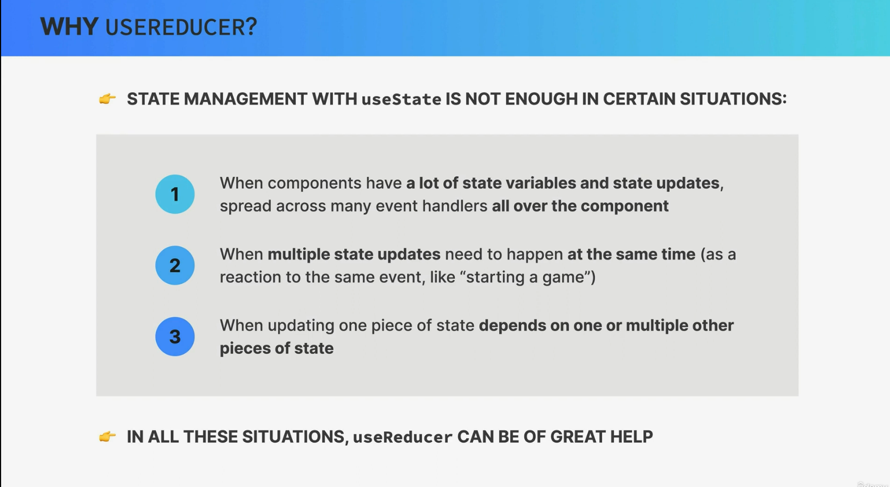
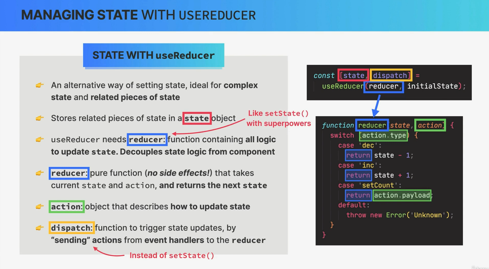

# useReducer





`useReducer` is a React hook that is used for managing state in functional components, especially when the state logic is complex or involves multiple sub-values, or when you need to perform actions based on dispatched actions. It is an alternative to `useState` and is often preferred when your state logic becomes more involved. `useReducer` takes a reducer function and an initial state as arguments and returns the current state and a dispatch function to update the state based on actions.

Here's how to use `useReducer`:

1. **Define a Reducer Function**:

   Start by defining a reducer function that specifies how the state should change in response to actions. The reducer function takes two arguments: the current state and an action object, and it returns the new state.

   ```jsx
   const reducer = (state, action) => {
     switch (action.type) {
       case "INCREMENT":
         return { count: state.count + 1 };
       case "DECREMENT":
         return { count: state.count - 1 };
       default:
         return state;
     }
   };
   ```

2. **Call `useReducer`**:

   In your functional component, call `useReducer` and pass in the reducer function and an initial state as arguments. It returns the current state and a dispatch function that you can use to send actions.

   ```jsx
   import React, { useReducer } from "react";

   function Counter() {
     const initialState = { count: 0 };
     const [state, dispatch] = useReducer(reducer, initialState);
     // ...
   }
   ```

3. **Dispatch Actions**:

   To update the state, you can call the `dispatch` function and provide an action object with a `type` property. The `type` property is used by the reducer function to determine how to update the state.

   ```jsx
   const increment = () => {
     dispatch({ type: "INCREMENT" });
   };

   const decrement = () => {
     dispatch({ type: "DECREMENT" });
   };
   ```

4. **Access and Use State**:

   You can access the current state by using `state.count` or the specific property you defined in your state object.

   ```jsx
   return (
     <div>
       <p>Count: {state.count}</p>
       <button onClick={increment}>Increment</button>
       <button onClick={decrement}>Decrement</button>
     </div>
   );
   ```

5. **Optional Actions Payload**:

   You can include additional data in the action object to provide more context for state updates. For example:

   ```jsx
   dispatch({ type: "INCREMENT", payload: 5 });
   ```

6. **Advanced Usage**:

   `useReducer` is particularly useful when managing complex state or state transitions, such as forms, multi-step wizards, or data fetching with more intricate loading/error handling.

Here's a complete example of a counter component using `useReducer`:

```jsx
import React, { useReducer } from "react";

const reducer = (state, action) => {
  switch (action.type) {
    case "INCREMENT":
      return { count: state.count + 1 };
    case "DECREMENT":
      return { count: state.count - 1 };
    default:
      return state;
  }
};

function Counter() {
  const initialState = { count: 0 };
  const [state, dispatch] = useReducer(reducer, initialState);

  const increment = () => {
    dispatch({ type: "INCREMENT" });
  };

  const decrement = () => {
    dispatch({ type: "DECREMENT" });
  };

  return (
    <div>
      <p>Count: {state.count}</p>
      <button onClick={increment}>Increment</button>
      <button onClick={decrement}>Decrement</button>
    </div>
  );
}

export default Counter;
```

In this example, `useReducer` is used to manage the count state, and the reducer function handles state updates based on actions. Actions are dispatched when the "Increment" and "Decrement" buttons are clicked.

# Getting Started with Create React App

This project was bootstrapped with [Create React App](https://github.com/facebook/create-react-app).

## Available Scripts

In the project directory, you can run:

### `npm start`

Runs the app in the development mode.\
Open [http://localhost:3000](http://localhost:3000) to view it in your browser.

The page will reload when you make changes.\
You may also see any lint errors in the console.

### `npm test`

Launches the test runner in the interactive watch mode.\
See the section about [running tests](https://facebook.github.io/create-react-app/docs/running-tests) for more information.

### `npm run build`

Builds the app for production to the `build` folder.\
It correctly bundles React in production mode and optimizes the build for the best performance.

The build is minified and the filenames include the hashes.\
Your app is ready to be deployed!

See the section about [deployment](https://facebook.github.io/create-react-app/docs/deployment) for more information.

### `npm run eject`

**Note: this is a one-way operation. Once you `eject`, you can't go back!**

If you aren't satisfied with the build tool and configuration choices, you can `eject` at any time. This command will remove the single build dependency from your project.

Instead, it will copy all the configuration files and the transitive dependencies (webpack, Babel, ESLint, etc) right into your project so you have full control over them. All of the commands except `eject` will still work, but they will point to the copied scripts so you can tweak them. At this point you're on your own.

You don't have to ever use `eject`. The curated feature set is suitable for small and middle deployments, and you shouldn't feel obligated to use this feature. However we understand that this tool wouldn't be useful if you couldn't customize it when you are ready for it.

## Learn More

You can learn more in the [Create React App documentation](https://facebook.github.io/create-react-app/docs/getting-started).

To learn React, check out the [React documentation](https://reactjs.org/).

### Code Splitting

This section has moved here: [https://facebook.github.io/create-react-app/docs/code-splitting](https://facebook.github.io/create-react-app/docs/code-splitting)

### Analyzing the Bundle Size

This section has moved here: [https://facebook.github.io/create-react-app/docs/analyzing-the-bundle-size](https://facebook.github.io/create-react-app/docs/analyzing-the-bundle-size)

### Making a Progressive Web App

This section has moved here: [https://facebook.github.io/create-react-app/docs/making-a-progressive-web-app](https://facebook.github.io/create-react-app/docs/making-a-progressive-web-app)

### Advanced Configuration

This section has moved here: [https://facebook.github.io/create-react-app/docs/advanced-configuration](https://facebook.github.io/create-react-app/docs/advanced-configuration)

### Deployment

This section has moved here: [https://facebook.github.io/create-react-app/docs/deployment](https://facebook.github.io/create-react-app/docs/deployment)

### `npm run build` fails to minify

This section has moved here: [https://facebook.github.io/create-react-app/docs/troubleshooting#npm-run-build-fails-to-minify](https://facebook.github.io/create-react-app/docs/troubleshooting#npm-run-build-fails-to-minify)
